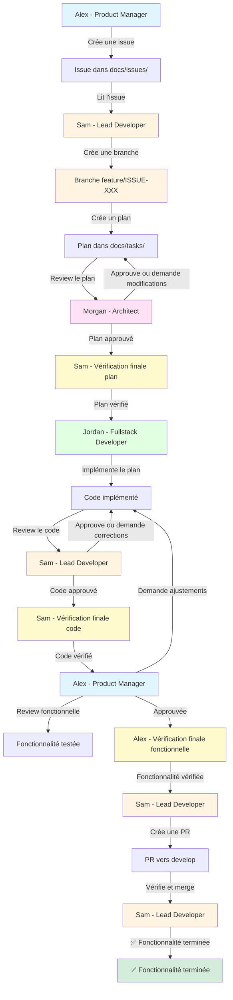

# Workflow - Space Xplorer

## Vue d'Ensemble

Ce document décrit le workflow complet de développement de Space Xplorer, de la création d'une issue produit jusqu'au merge de la Pull Request dans `develop`. Le workflow garantit la qualité technique et fonctionnelle à chaque étape grâce à des reviews approfondies et des vérifications finales perfectionnistes.

## Schéma du Workflow



## Étapes Détaillées

### 1. Création d'Issue (Alex - Product Manager)

**Agent** : Alex (Product Manager)  
**Action** : `create-issue`  
**Input** : Besoin produit, fonctionnalité à développer  
**Output** : Issue dans `docs/issues/ISSUE-{numero}-{titre}.md`

**Contenu** :
- Description de la fonctionnalité
- Contexte métier
- Critères d'acceptation
- Priorité
- Section "Suivi et Historique" avec statut "À faire"

**Tracking** : 
- Créer la section "Suivi et Historique" dans l'issue
- Ajouter une première entrée avec statut "À faire"
- Format : Voir [update-tracking.md](./docs/prompts/update-tracking.md)

**Référence** : [create-issue.md](./docs/prompts/create-issue.md)

---

### 2. Création de Branche (Sam - Lead Developer)

**Agent** : Sam (Lead Developer)  
**Action** : Créer une branche Git  
**Input** : Issue produit  
**Output** : Branche `feature/ISSUE-{numero}-{titre-kebab-case}`

**Commande** :
```bash
git checkout develop
git pull origin develop
git checkout -b feature/ISSUE-001-implement-user-registration
```

**Convention** : `feature/ISSUE-{numero}-{titre-kebab-case}`

---

### 3. Création du Plan (Sam - Lead Developer)

**Agent** : Sam (Lead Developer)  
**Action** : `create-plan`  
**Input** : Issue produit  
**Output** : Plan dans `docs/tasks/TASK-{numero}-{titre}.md`

**Contenu** :
- Vue d'ensemble technique
- Architecture & Design
- Tâches de développement décomposées
- Migrations nécessaires
- Endpoints API
- Événements & Listeners
- Tests à écrire
- Ordre d'exécution
- Section "Suivi et Historique" avec statut "À faire"

**Tracking** :
- Créer la section "Suivi et Historique" dans le plan avec statut "À faire"
- Mettre à jour l'issue associée : statut "En cours", ajouter une entrée dans l'historique
- Format : Voir [update-tracking.md](./docs/prompts/update-tracking.md)

**Référence** : [create-plan.md](./docs/prompts/create-plan.md)

---

### 4. Review Architecturale (Morgan - Architect)

**Agent** : Morgan (Architect)  
**Action** : `review-task`  
**Input** : Plan de développement  
**Output** : Review dans le plan ou fichier séparé

**Vérifications** :
- ✅ Cohérence architecturale
- ✅ Qualité technique
- ✅ Performance & Scalabilité
- ✅ Sécurité
- ✅ Tests
- ✅ Documentation

**Statuts possibles** :
- ✅ Approuvé : Le plan peut être implémenté tel quel
- ⚠️ Approuvé avec recommandations : Le plan est approuvé mais des améliorations sont suggérées (optionnelles)
- ❌ Retour pour modifications : Le plan nécessite des modifications avant implémentation

**Processus de réitération** :
- **Objectif** : Le plan doit être parfaitement aligné avec l'architecture et les standards techniques avant implémentation
- Si **❌ Retour pour modifications** : Sam doit modifier le plan selon les recommandations de Morgan
- Le plan modifié est soumis à nouveau à Morgan pour review
- **Boucle jusqu'à approbation** : Le processus se répète jusqu'à ce que le plan soit approuvé (✅ ou ⚠️)
- **Garde-fou** : Maximum **3 itérations** - Si après 3 reviews le plan n'est toujours pas approuvé, une discussion entre Sam et Morgan est nécessaire pour identifier les blocages
- **Vérification finale perfectionniste** : Même après approbation (✅ ou ⚠️), Sam effectue une dernière vérification complète du plan pour s'assurer que tout est vraiment parfait avant de passer à l'implémentation
- Une fois approuvé ET vérifié finalement, le workflow continue vers l'implémentation

**Tracking** :
- Mettre à jour le plan : ajouter une entrée dans l'historique avec le résultat de la review
- Inclure les recommandations dans l'entrée d'historique
- Si retour pour modifications, documenter les changements apportés dans l'historique
- Après approbation : Documenter la vérification finale perfectionniste effectuée par Sam
- Format : Voir [update-tracking.md](./docs/prompts/update-tracking.md)

**Référence** : [review-task.md](./docs/prompts/review-task.md)

---

### 5. Implémentation (Jordan - Fullstack Developer)

**Agent** : Jordan (Fullstack Developer)  
**Action** : `implement-task`  
**Input** : Plan approuvé  
**Output** : Code implémenté

**Tâches** :
- Créer les migrations
- Créer les modèles
- Créer les services
- Créer les controllers
- Créer les events & listeners
- Créer les form requests
- Écrire les tests
- Mettre à jour la documentation

**Ordre** : Respecter l'ordre défini dans le plan

**Tracking** :
- Mettre à jour le plan régulièrement pendant l'implémentation
- Marquer les tâches comme terminées dans le plan
- Ajouter des entrées dans l'historique du plan pour chaque phase importante
- Mettre à jour le statut du plan à "En cours" si nécessaire
- Format : Voir [update-tracking.md](./docs/prompts/update-tracking.md)

**Référence** : [implement-task.md](./docs/prompts/implement-task.md)

---

### 6. Review du Code (Sam - Lead Developer)

**Agent** : Sam (Lead Developer)  
**Action** : `review-implementation`  
**Input** : Code implémenté  
**Output** : Review du code

**Vérifications** :
- ✅ Respect du plan
- ✅ Conventions Laravel
- ✅ Qualité du code
- ✅ Tests complets et passants
- ✅ Documentation mise à jour

**Statuts possibles** :
- ✅ Approuvé : Le code respecte le plan et les standards, peut passer à la review fonctionnelle
- ⚠️ Approuvé avec modifications mineures : Le code est globalement bon mais nécessite des corrections mineures (peut être fait en parallèle de la review fonctionnelle)
- ❌ Retour pour corrections : Le code nécessite des corrections importantes avant validation

**Processus de réitération** :
- **Objectif** : Le code doit être parfaitement conforme à la task (plan technique) avant validation
- Si **❌ Retour pour corrections** : Jordan doit corriger le code selon les recommandations de Sam
- Le code corrigé est soumis à nouveau à Sam pour review
- **Boucle jusqu'à perfection technique** : Le processus se répète jusqu'à ce que le code soit parfaitement aligné avec le plan technique et les standards de qualité
- **Garde-fou** : Maximum **3 itérations** - Si après 3 reviews le code n'est toujours pas approuvé, une discussion entre Jordan et Sam est nécessaire pour identifier les blocages
- Si **⚠️ Approuvé avec modifications mineures** : Les corrections peuvent être faites en parallèle ou après la review fonctionnelle selon leur criticité, mais doivent être faites avant le merge
- **Vérification finale perfectionniste** : Même après approbation (✅ ou ⚠️), Sam effectue une dernière vérification complète du code pour s'assurer que tout est vraiment parfait (respect du plan, tests, qualité, documentation) avant de passer à la review fonctionnelle
- Une fois approuvé ET vérifié finalement, le workflow continue vers la review fonctionnelle

**Tracking** :
- Mettre à jour le plan : statut "En review", ajouter une entrée dans l'historique
- Mettre à jour l'issue : statut "En review", ajouter une entrée dans l'historique
- Inclure les résultats de la review dans les entrées d'historique
- Si retour pour corrections, documenter les corrections apportées dans l'historique
- Après approbation : Documenter la vérification finale perfectionniste effectuée par Sam
- Format : Voir [update-tracking.md](./docs/prompts/update-tracking.md)

**Référence** : [review-implementation.md](./docs/prompts/review-implementation.md)

---

### 7. Review Fonctionnelle (Alex - Product Manager)

**Agent** : Alex (Product Manager)  
**Action** : `review-functional`  
**Input** : Code approuvé par Sam, fonctionnalité testable  
**Output** : Review fonctionnelle

**Vérifications** :
- ✅ Les critères d'acceptation de l'issue sont respectés
- ✅ L'expérience utilisateur correspond aux attentes
- ✅ Les fonctionnalités métier sont correctement implémentées
- ✅ Les cas d'usage sont couverts
- ✅ L'interface est intuitive et agréable

**Statuts possibles** :
- ✅ Approuvé fonctionnellement : Tous les critères d'acceptation sont respectés, peut créer la PR
- ⚠️ Approuvé avec ajustements mineurs : La fonctionnalité est bonne mais des ajustements UX mineurs sont suggérés (peuvent être faits dans une issue séparée ou avant la PR)
- ❌ Retour pour ajustements fonctionnels : Des ajustements fonctionnels importants sont nécessaires

**Processus de réitération** :
- **Objectif** : Tous les critères d'acceptation de l'issue doivent être parfaitement respectés avant création de la PR
- Si **❌ Retour pour ajustements fonctionnels** : Jordan doit implémenter les ajustements selon les recommandations d'Alex
- Le code ajusté est soumis à nouveau à Sam pour review technique, puis à Alex pour review fonctionnelle
- **Boucle jusqu'à perfection fonctionnelle** : Le processus se répète jusqu'à ce que tous les critères d'acceptation de l'issue soient parfaitement respectés
- **Garde-fou** : Maximum **3 itérations** - Si après 3 reviews fonctionnelles la fonctionnalité n'est toujours pas approuvée, une discussion entre Alex, Sam et Jordan est nécessaire pour clarifier les attentes
- Si **⚠️ Approuvé avec ajustements mineurs** : Les ajustements doivent être faits avant la PR si ils concernent les critères d'acceptation, sinon peuvent être traités dans une issue séparée
- **Vérification finale perfectionniste** : Même après approbation (✅ ou ⚠️), Alex effectue une dernière vérification complète de la fonctionnalité pour s'assurer que tous les critères d'acceptation sont vraiment respectés et que l'expérience utilisateur est parfaite avant de créer la PR
- Une fois approuvé ET vérifié finalement, le workflow continue vers la création de la PR

**Tracking** :
- Mettre à jour l'issue : statut "Approuvé" ou "En cours" selon le résultat, ajouter une entrée dans l'historique
- Mettre à jour le plan : ajouter une entrée dans l'historique avec le résultat de la review fonctionnelle
- Inclure les ajustements suggérés dans l'entrée d'historique
- Si retour pour ajustements, documenter les ajustements apportés dans l'historique
- Après approbation : Documenter la vérification finale perfectionniste effectuée par Alex
- Format : Voir [update-tracking.md](./docs/prompts/update-tracking.md)

**Référence** : [review-functional.md](./docs/prompts/review-functional.md)

---

### 8. Création de Pull Request (Sam - Lead Developer)

**Agent** : Sam (Lead Developer)  
**Action** : `create-pr`  
**Input** : Code approuvé fonctionnellement par Alex  
**Output** : Pull Request vers `develop`

**Contenu de la PR** :
- Description de la fonctionnalité
- Lien vers l'issue associée
- Lien vers le plan de développement
- Résumé des changements
- Checklist de validation

**Tracking** :
- Mettre à jour l'issue : statut "En review", ajouter une entrée avec le lien vers la PR
- Mettre à jour le plan : statut "Approuvé", ajouter une entrée avec le lien vers la PR
- Format : Voir [update-tracking.md](./docs/prompts/update-tracking.md)

**Référence** : [create-pr.md](./docs/prompts/create-pr.md)

---

### 9. Merge de la Pull Request (Sam - Lead Developer)

**Agent** : Sam (Lead Developer)  
**Action** : Merger la PR dans `develop`  
**Input** : Pull Request créée et validée  
**Output** : Code mergé dans `develop`

**Conditions préalables** :
- ✅ Code approuvé techniquement par Sam (review du code)
- ✅ Fonctionnalité approuvée fonctionnellement par Alex (review fonctionnelle)
- ✅ Tous les tests passent
- ✅ Aucun conflit avec `develop`
- ✅ Documentation à jour

**Processus de merge** :
1. **Vérification finale** : Sam vérifie une dernière fois que toutes les conditions sont remplies
2. **Merge** : Sam merge la PR dans `develop` (merge commit ou squash selon les conventions du projet)
3. **Nettoyage** : Supprimer la branche feature après le merge (optionnel mais recommandé)
4. **Tracking final** : Mettre à jour les documents pour marquer la fonctionnalité comme terminée

**Tracking** :
- **Sam** met à jour l'issue : statut "Terminé", ajouter une entrée finale avec la date de merge
- **Sam** met à jour le plan : statut "Terminé", ajouter une entrée finale avec la date de merge
- Inclure le hash du commit de merge dans les entrées d'historique
- Documenter la fin du workflow dans les deux documents (issue et task)
- Format : Voir [update-tracking.md](./docs/prompts/update-tracking.md)

**Note** : Si des ajustements mineurs ont été suggérés lors de la review fonctionnelle mais n'ont pas été faits avant la PR, ils peuvent être traités dans une issue séparée ou dans une PR suivante.

---

## Flux Complet

```
┌─────────────────────────────────────────────────────────────────┐
│                    WORKFLOW SPACE XPLORER                        │
└─────────────────────────────────────────────────────────────────┘

1. 📝 ALEX (Product)
   └─> Crée ISSUE-001 dans docs/issues/
       │
       ▼
2. 🌿 SAM (Lead Dev)
   └─> Crée la branche feature/ISSUE-001
       │
       ▼
3. 📋 SAM (Lead Dev)
   └─> Lit l'issue et crée TASK-001 dans docs/tasks/
       │
       ▼
4. 🔍 MORGAN (Architect)
   └─> Review le plan TASK-001
       │
       ├─> ❌ Retour pour modifications ──┐
       │                                   │
       └─> ✅ Approuvé                    │
           │                              │
           ▼                              │
   ✅ SAM (Lead Dev) - Vérification finale│
   └─> Vérifie une dernière fois le plan │
       │                                  │
       ▼                                  │
5. 💻 JORDAN (Fullstack Dev)             │
   └─> Implémente le plan                 │
       │                                  │
       ├─> Crée les migrations            │
       ├─> Crée les modèles               │
       ├─> Crée les services              │
       ├─> Crée les controllers           │
       ├─> Crée les events/listeners      │
       ├─> Écrit les tests                │
       └─> Met à jour la documentation    │
           │                              │
           ▼                              │
6. ✅ SAM (Lead Dev)                      │
   └─> Review le code implémenté          │
       │                                  │
       ├─> ❌ Retour pour corrections ────┐
       │                                   │
       └─> ✅ Approuvé                    │
           │                              │
           ▼                              │
   ✅ SAM (Lead Dev) - Vérification finale│
   └─> Vérifie une dernière fois le code │
       │                                  │
       ▼                                  │
7. 🎯 ALEX (Product)                     │
   └─> Review fonctionnelle              │
       │                                  │
       ├─> ❌ Retour pour ajustements ────┐
       │                                   │
       └─> ✅ Approuvé fonctionnellement │
           │                              │
           ▼                              │
   ✅ ALEX (Product) - Vérification finale│
   └─> Vérifie une dernière fois la fonct.│
       │                                  │
       ▼                                  │
8. 🔀 SAM (Lead Dev)                     │
   └─> Crée la Pull Request              │
       │                                  │
       └─> PR vers develop                │
           │                              │
           ▼                              │
9. ✅ SAM (Lead Dev)                     │
   └─> Merge la PR dans develop           │
       │                                  │
       ├─> Vérifie les conditions        │
       ├─> Merge la PR                   │
       ├─> Supprime la branche feature   │
       └─> Met à jour les documents       │
           │                              │
           ▼                              │
       🎉 FONCTIONNALITÉ TERMINÉE
```

## Rôles et Responsabilités

| Agent | Rôle | Responsabilités Principales |
|-------|------|----------------------------|
| **Alex** | Product Manager | Vision produit, création d'issues, priorisation, review fonctionnelle |
| **Sam** | Lead Developer | Création de branche, création de plans, review du code, création de PR, merge de PR |
| **Morgan** | Architect | Review architecturale, cohérence technique |
| **Jordan** | Fullstack Developer | Implémentation du code, écriture des tests |

## Principes de Qualité

Le workflow est conçu pour garantir que chaque fonctionnalité soit **parfaitement alignée** avant de passer à l'étape suivante :

### Qualité Technique (Task)

- **Objectif** : Le code doit être parfaitement conforme au plan technique (task)
- **Critères** : Respect du plan, standards de code, tests complets, documentation à jour
- **Processus** : Boucle jusqu'à ce que Sam approuve techniquement le code
- **Validation** : Le code ne passe à la review fonctionnelle que s'il est techniquement parfait

### Qualité Fonctionnelle (Issue)

- **Objectif** : Tous les critères d'acceptation de l'issue doivent être parfaitement respectés
- **Critères** : Expérience utilisateur, fonctionnalités métier, cas d'usage, interface intuitive
- **Processus** : Boucle jusqu'à ce qu'Alex approuve fonctionnellement la fonctionnalité
- **Validation** : La PR n'est créée que si tous les critères d'acceptation sont respectés

### Principe de Boucle

Chaque étape de review peut nécessiter plusieurs itérations jusqu'à atteindre la perfection :
- **Pas de compromis sur la qualité** : On boucle jusqu'à ce que ce soit "nickel"
- **Garde-fou** : Maximum 3 itérations avant escalade pour éviter les boucles infinies
- **Communication** : Si après 3 itérations ce n'est toujours pas parfait, discussion entre agents pour clarifier les attentes

### Vérification Finale Perfectionniste

Même après approbation à chaque étape, une **vérification finale** est effectuée pour garantir que tout est vraiment parfait :

- **Après approbation du plan** : Sam vérifie une dernière fois que le plan est complet et prêt pour l'implémentation
- **Après approbation technique** : Sam effectue une dernière vérification complète du code (plan, tests, qualité, documentation) avant la review fonctionnelle
- **Après approbation fonctionnelle** : Alex effectue une dernière vérification complète de la fonctionnalité (critères d'acceptation, UX, cas d'usage) avant la création de la PR

Cette approche perfectionniste garantit qu'aucun détail n'est oublié et que chaque étape est vraiment parfaite avant de continuer.

## Points de Contrôle

1. **Issue Produit** : Validée par Alex avant création
2. **Branche Git** : Créée par Sam avant le développement
3. **Plan Technique** : Reviewé par Morgan avant implémentation - **Boucle jusqu'à approbation** + **Vérification finale perfectionniste par Sam**
4. **Code Implémenté** : Reviewé par Sam avant validation technique - **Boucle jusqu'à perfection technique** + **Vérification finale perfectionniste par Sam**
5. **Fonctionnalité** : Reviewée par Alex avant validation finale - **Boucle jusqu'à perfection fonctionnelle** + **Vérification finale perfectionniste par Alex**
6. **Pull Request** : Créée par Sam pour merger dans develop
7. **Merge** : Effectué par Sam après vérification des conditions préalables

## Suivi et Tracking

À chaque étape du workflow, les documents (issues et tasks) doivent être mis à jour pour suivre la progression :

- **Issue** (`docs/issues/`) : Mise à jour par Alex (création, review fonctionnelle) et Sam (création du plan, review du code, création de PR, merge final)
- **Task** (`docs/tasks/`) : Mise à jour par Sam (création, merge final), Morgan (review architecturale), Jordan (implémentation), Sam (review du code), Alex (review fonctionnelle)

**Format de tracking** : Chaque document doit contenir une section "Suivi et Historique" avec :
- Statut actuel (À faire, En cours, En review, Approuvé, Terminé)
- Historique chronologique des actions avec dates, agents, détails et fichiers modifiés

**Référence** : [update-tracking.md](./docs/prompts/update-tracking.md) pour le format détaillé et les exemples

## Synchronisation entre Agents

Pour maintenir la cohérence et la transparence, les agents doivent synchroniser leurs actions via les documents :

### Principe de Synchronisation

1. **Lecture avant action** : Chaque agent doit lire les documents à jour avant d'agir
   - Sam lit l'issue avant de créer le plan
   - Morgan lit le plan avant la review architecturale
   - Jordan lit le plan approuvé avant l'implémentation
   - Sam lit le code et le plan avant la review du code
   - Alex lit l'issue et teste la fonctionnalité avant la review fonctionnelle

2. **Mise à jour immédiate** : Chaque agent met à jour les documents immédiatement après son action
   - Les mises à jour permettent aux autres agents de voir l'état actuel
   - Les entrées d'historique documentent les décisions et l'évolution

3. **Communication via documents** : Les documents servent de canal de communication
   - Les recommandations sont documentées dans les entrées d'historique
   - Les questions ou blocages sont notés dans les sections "Notes" des entrées
   - Les décisions importantes sont documentées pour référence future

### Points de Synchronisation

- **Issue ↔ Task** : L'issue et le plan associé doivent être synchronisés
  - Quand le plan est créé, l'issue passe à "En cours"
  - Quand le code est reviewé, les deux documents sont mis à jour
  - Quand la PR est créée, les deux documents référencent la PR

- **Plan ↔ Code** : Le plan guide l'implémentation et doit être mis à jour pendant le développement
  - Jordan marque les tâches terminées dans le plan
  - Les phases importantes sont documentées dans l'historique du plan

- **Reviews ↔ Documents** : Toutes les reviews doivent être documentées
  - Les résultats des reviews sont ajoutés dans l'historique
  - Les recommandations sont clairement documentées pour référence

## Gestion des Dépendances

Les issues et tasks peuvent avoir des dépendances entre elles. Il est important de gérer ces dépendances pour éviter les blocages.

### Types de Dépendances

1. **Dépendance fonctionnelle** : Une issue nécessite qu'une autre issue soit terminée
   - Exemple : "ISSUE-002 : Explorer une planète" dépend de "ISSUE-001 : Inscription utilisateur"
   - La dépendance doit être documentée dans la section "Notes" ou "Dépendances" de l'issue

2. **Dépendance technique** : Une task nécessite qu'une autre task soit terminée
   - Exemple : "TASK-002 : Système de navigation" dépend de "TASK-001 : Modèle Planet"
   - Les dépendances sont gérées dans l'ordre d'exécution du plan

3. **Dépendance de code** : Une fonctionnalité dépend d'un code existant ou d'une autre branche
   - Exemple : Une feature dépend d'une autre feature en cours de développement
   - La dépendance doit être documentée dans le plan technique

### Gestion des Dépendances dans le Workflow

#### Lors de la Création d'Issue (Alex)

- **Identifier les dépendances** : Alex doit identifier si l'issue dépend d'autres issues
- **Documenter** : Ajouter une section "Dépendances" dans l'issue listant les issues prérequises
- **Priorisation** : Les issues avec dépendances doivent être priorisées après leurs dépendances

#### Lors de la Création du Plan (Sam)

- **Vérifier les dépendances** : Sam doit vérifier les dépendances de l'issue avant de créer le plan
- **Bloquer si nécessaire** : Si une dépendance n'est pas terminée, le plan peut être créé mais l'implémentation doit attendre
- **Documenter dans le plan** : Mentionner les dépendances dans la section "Notes Techniques" du plan
- **Ordre d'exécution** : Organiser les tâches en tenant compte des dépendances techniques

#### Pendant l'Implémentation (Jordan)

- **Vérifier les prérequis** : Avant de commencer, vérifier que toutes les dépendances sont terminées
- **Bloquer si nécessaire** : Si une dépendance n'est pas terminée, documenter le blocage dans l'historique du plan
- **Coordination** : Si plusieurs tasks dépendent les unes des autres, coordonner avec Sam pour l'ordre d'exécution

### Gestion des Blocages

Si une dépendance bloque le développement :

1. **Documenter le blocage** : Ajouter une entrée dans l'historique du plan/issue expliquant le blocage
2. **Identifier les alternatives** : Chercher des alternatives ou des solutions de contournement
3. **Prioriser les dépendances** : Si possible, accélérer le développement des dépendances bloquantes
4. **Communication** : Informer les agents concernés (Alex pour les dépendances fonctionnelles, Sam pour les dépendances techniques)

### Exemple de Documentation de Dépendance

Dans une issue :
```markdown
## Dépendances

- **ISSUE-001** : Inscription utilisateur (Terminé ✅)
- **ISSUE-003** : Système de planètes (En cours ⏳) - Bloque le développement
```

Dans un plan :
```markdown
## Notes Techniques

**Dépendances** :
- Ce plan dépend de TASK-001 (Modèle Planet) qui doit être terminé avant l'implémentation
- Si TASK-001 n'est pas terminé, les tâches 2.1 à 2.3 ne peuvent pas être démarrées
```

## Documents Générés

- `docs/issues/ISSUE-{numero}-{titre}.md` : Issues produit
- `docs/tasks/TASK-{numero}-{titre}.md` : Plans de développement
- Code source : Fichiers PHP, migrations, tests, etc.

## Résumé du Workflow

Le workflow Space Xplorer suit un processus rigoureux en **9 étapes principales** :

1. **Création d'Issue** (Alex) → Issue produit documentée
2. **Création de Branche** (Sam) → Branche Git créée
3. **Création du Plan** (Sam) → Plan technique détaillé
4. **Review Architecturale** (Morgan) → Plan approuvé + **Vérification finale** (Sam)
5. **Implémentation** (Jordan) → Code implémenté selon le plan
6. **Review du Code** (Sam) → Code approuvé + **Vérification finale** (Sam)
7. **Review Fonctionnelle** (Alex) → Fonctionnalité approuvée + **Vérification finale** (Alex)
8. **Création de PR** (Sam) → Pull Request créée
9. **Merge** (Sam) → Code mergé dans `develop` + Documents mis à jour

**Points clés** :
- ✅ Boucles jusqu'à perfection à chaque étape de review
- ✅ Vérifications finales perfectionnistes après chaque approbation
- ✅ Tracking complet dans les documents (issues et tasks)
- ✅ Synchronisation entre agents via les documents
- ✅ Gestion des dépendances et blocages

## Références

- [AGENTS.md](./AGENTS.md) : Liste complète des agents
- [docs/prompts/](./docs/prompts/) : Guides d'actions pour chaque agent
- [docs/agents/](./docs/agents/) : Descriptions détaillées des agents

