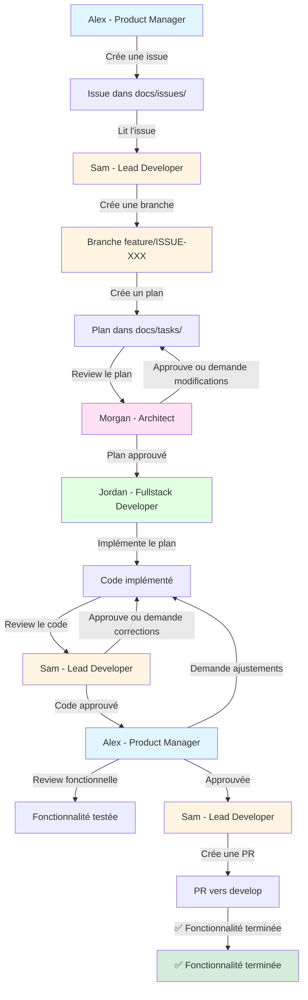

# Workflow - Space Xplorer

## Vue d'Ensemble

Ce document décrit le workflow complet de développement de Space Xplorer, de la création d'une issue produit à l'implémentation et la review du code.

## Schéma du Workflow



## Étapes Détaillées

### 1. Création d'Issue (Alex - Product Manager)

**Agent** : Alex (Product Manager)  
**Action** : `create-issue`  
**Input** : Besoin produit, fonctionnalité à développer  
**Output** : Issue dans `docs/issues/ISSUE-{numero}-{titre}.md`

**Contenu** :
- Description de la fonctionnalité
- Contexte métier
- Critères d'acceptation
- Priorité

**Référence** : [create-issue.md](./docs/prompts/create-issue.md)

---

### 2. Création de Branche (Sam - Lead Developer)

**Agent** : Sam (Lead Developer)  
**Action** : Créer une branche Git  
**Input** : Issue produit  
**Output** : Branche `feature/ISSUE-{numero}-{titre-kebab-case}`

**Commande** :
```bash
git checkout develop
git pull origin develop
git checkout -b feature/ISSUE-001-implement-user-registration
```

**Convention** : `feature/ISSUE-{numero}-{titre-kebab-case}`

---

### 3. Création du Plan (Sam - Lead Developer)

**Agent** : Sam (Lead Developer)  
**Action** : `create-plan`  
**Input** : Issue produit  
**Output** : Plan dans `docs/tasks/TASK-{numero}-{titre}.md`

**Contenu** :
- Vue d'ensemble technique
- Architecture & Design
- Tâches de développement décomposées
- Migrations nécessaires
- Endpoints API
- Événements & Listeners
- Tests à écrire
- Ordre d'exécution

**Référence** : [create-plan.md](./docs/prompts/create-plan.md)

---

### 4. Review Architecturale (Morgan - Architect)

**Agent** : Morgan (Architect)  
**Action** : `review-task`  
**Input** : Plan de développement  
**Output** : Review dans le plan ou fichier séparé

**Vérifications** :
- ✅ Cohérence architecturale
- ✅ Qualité technique
- ✅ Performance & Scalabilité
- ✅ Sécurité
- ✅ Tests
- ✅ Documentation

**Statuts possibles** :
- ✅ Approuvé
- ⚠️ Approuvé avec recommandations
- ❌ Retour pour modifications

**Référence** : [review-task.md](./docs/prompts/review-task.md)

---

### 5. Implémentation (Jordan - Fullstack Developer)

**Agent** : Jordan (Fullstack Developer)  
**Action** : `implement-task`  
**Input** : Plan approuvé  
**Output** : Code implémenté

**Tâches** :
- Créer les migrations
- Créer les modèles
- Créer les services
- Créer les controllers
- Créer les events & listeners
- Créer les form requests
- Écrire les tests
- Mettre à jour la documentation

**Ordre** : Respecter l'ordre défini dans le plan

**Référence** : [implement-task.md](./docs/prompts/implement-task.md)

---

### 6. Review du Code (Sam - Lead Developer)

**Agent** : Sam (Lead Developer)  
**Action** : `review-implementation`  
**Input** : Code implémenté  
**Output** : Review du code

**Vérifications** :
- ✅ Respect du plan
- ✅ Conventions Laravel
- ✅ Qualité du code
- ✅ Tests complets et passants
- ✅ Documentation mise à jour

**Statuts possibles** :
- ✅ Approuvé
- ⚠️ Approuvé avec modifications mineures
- ❌ Retour pour corrections

**Référence** : [review-implementation.md](./docs/prompts/review-implementation.md)

---

### 7. Review Fonctionnelle (Alex - Product Manager)

**Agent** : Alex (Product Manager)  
**Action** : `review-functional`  
**Input** : Code approuvé par Sam, fonctionnalité testable  
**Output** : Review fonctionnelle

**Vérifications** :
- ✅ Les critères d'acceptation de l'issue sont respectés
- ✅ L'expérience utilisateur correspond aux attentes
- ✅ Les fonctionnalités métier sont correctement implémentées
- ✅ Les cas d'usage sont couverts
- ✅ L'interface est intuitive et agréable

**Statuts possibles** :
- ✅ Approuvé fonctionnellement
- ⚠️ Approuvé avec ajustements mineurs
- ❌ Retour pour ajustements fonctionnels

**Référence** : [review-functional.md](./docs/prompts/review-functional.md)

---

### 8. Création de Pull Request (Sam - Lead Developer)

**Agent** : Sam (Lead Developer)  
**Action** : `create-pr`  
**Input** : Code approuvé fonctionnellement par Alex  
**Output** : Pull Request vers `develop`

**Contenu de la PR** :
- Description de la fonctionnalité
- Lien vers l'issue associée
- Lien vers le plan de développement
- Résumé des changements
- Checklist de validation

**Référence** : [create-pr.md](./docs/prompts/create-pr.md)

---

## Flux Complet

```
┌─────────────────────────────────────────────────────────────────┐
│                    WORKFLOW SPACE XPLORER                        │
└─────────────────────────────────────────────────────────────────┘

1. 📝 ALEX (Product)
   └─> Crée ISSUE-001 dans docs/issues/
       │
       ▼
2. 🌿 SAM (Lead Dev)
   └─> Crée la branche feature/ISSUE-001
       │
       ▼
3. 📋 SAM (Lead Dev)
   └─> Lit l'issue et crée TASK-001 dans docs/tasks/
       │
       ▼
4. 🔍 MORGAN (Architect)
   └─> Review le plan TASK-001
       │
       ├─> ❌ Retour pour modifications ──┐
       │                                   │
       └─> ✅ Approuvé                    │
           │                              │
           ▼                              │
5. 💻 JORDAN (Fullstack Dev)             │
   └─> Implémente le plan                 │
       │                                  │
       ├─> Crée les migrations            │
       ├─> Crée les modèles               │
       ├─> Crée les services              │
       ├─> Crée les controllers           │
       ├─> Crée les events/listeners      │
       ├─> Écrit les tests                │
       └─> Met à jour la documentation    │
           │                              │
           ▼                              │
6. ✅ SAM (Lead Dev)                      │
   └─> Review le code implémenté          │
       │                                  │
       ├─> ❌ Retour pour corrections ────┐
       │                                   │
       └─> ✅ Approuvé                    │
           │                              │
           ▼                              │
7. 🎯 ALEX (Product)                     │
   └─> Review fonctionnelle              │
       │                                  │
       ├─> ❌ Retour pour ajustements ────┐
       │                                   │
       └─> ✅ Approuvé fonctionnellement │
           │                              │
           ▼                              │
8. 🔀 SAM (Lead Dev)                     │
   └─> Crée la Pull Request              │
       │                                  │
       └─> PR vers develop                │
           │                              │
           ▼                              │
       🎉 FONCTIONNALITÉ TERMINÉE
```

## Rôles et Responsabilités

| Agent | Rôle | Responsabilités Principales |
|-------|------|----------------------------|
| **Alex** | Product Manager | Vision produit, création d'issues, priorisation, review fonctionnelle |
| **Sam** | Lead Developer | Création de branche, création de plans, review du code, création de PR |
| **Morgan** | Architect | Review architecturale, cohérence technique |
| **Jordan** | Fullstack Developer | Implémentation du code, écriture des tests |

## Points de Contrôle

1. **Issue Produit** : Validée par Alex avant création
2. **Branche Git** : Créée par Sam avant le développement
3. **Plan Technique** : Reviewé par Morgan avant implémentation
4. **Code Implémenté** : Reviewé par Sam avant validation technique
5. **Fonctionnalité** : Reviewée par Alex avant validation finale
6. **Pull Request** : Créée par Sam pour merger dans develop

## Documents Générés

- `docs/issues/ISSUE-{numero}-{titre}.md` : Issues produit
- `docs/tasks/TASK-{numero}-{titre}.md` : Plans de développement
- Code source : Fichiers PHP, migrations, tests, etc.

## Références

- [AGENTS.md](./AGENTS.md) : Liste complète des agents
- [docs/prompts/](./docs/prompts/) : Guides d'actions pour chaque agent
- [docs/agents/](./docs/agents/) : Descriptions détaillées des agents

