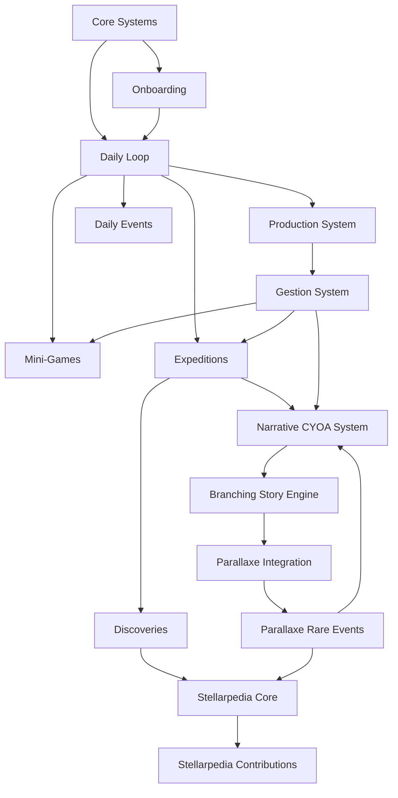
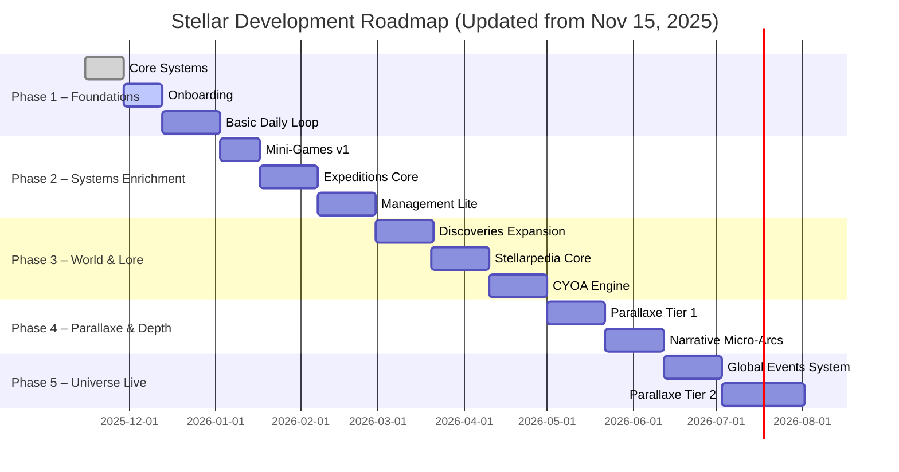

# Stellar – Dependency Roadmap (Visual Tree)

Ce document présente un arbre de dépendances global entre les systèmes : onboarding, mini-jeux, gestion, Stellarpedia, narration CYOA et Parallaxe. Le but est de visualiser l'ordre logique de développement, les prérequis et les blocages.

---

## 1. Vue globale (Mermaid)

---

## 2. Explication de l'arbre

### **A. Core Systems**
Base technique : utilisateurs, planètes d'origine, UI minimale, backend stable.

### **B. Onboarding**
Prérequis : Core Systems

Débloque : Daily Loop (boucle quotidienne complète).

---

## 3. Daily Loop
Composée de :
- Production du jour
- Mini-jeu du jour
- Événement du jour
- Expédition du jour

### Dépendances internes
- La production alimente la gestion.
- Les mini-jeux influencent les récompenses.
- Les expéditions mènent aux découvertes.

---

## 4. Gestion (Management)
Prérequis : Production

Influence :
- Difficulté mini-jeux
- Chances d'expédition
- Résolution des événements narratifs

---

## 5. Narration à choix (CYOA)
Prérequis : Expéditions + Daily Events

Débloque :
- Micro-arcs narratifs
- Choix impactant
- Conséquences persistantes

---

## 6. Stellarpedia
Prérequis : Discoveries

Étapes :
1. Architecture
2. Contributions
3. Votes & canonisation
4. Entrées rares liées au Parallaxe

---

## 7. Parallaxe (Fil rouge)
Prérequis : CYOA + Expéditions

Implique :
- Branches secrètes
- Glitchs narratifs
- Indices rares
- Entrées cachées dans le Stellarpedia

---

## 8. Roadmap en phases

### **Phase 1 – Fondations**
- Core Systems
- Onboarding
- Daily Loop basique

### **Phase 2 – Systems Richness**
- Mini-games supplémentaires
- Production & Gestion
- Expéditions enrichies

### **Phase 3 – Lore & Monde**
- Stellarpedia complet
- Discoveries étendus
- CYOA avancé

### **Phase 4 – Mystère et profondeur**
- Parallaxe niveau 1
- Micro-arcs persistants
- Branches secrètes

### **Phase 5 – Univers vivant**
- Events globaux
- Parallaxe niveau 2
- Contenu hebdomadaire optionnel

# Stellar – Visual Roadmap

Mise à jour avec point de départ : **15 novembre 2025**.

